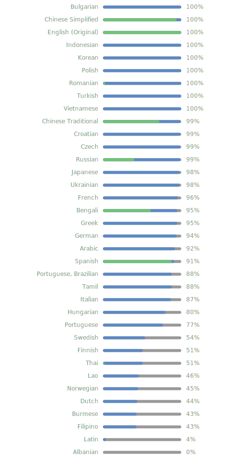

# Android Easter Eggs


<div align="center">

**[English](./README.md) • [中文](./README_zh.md) • [日本語](./README_ja.md)**


[](https://hits.sh/github.com/kqkqku86-a11y/AndroidEasterEggs/)


</br>
[%3D'svg'%5D%2F*%5Blocal-name()%3D'g'%5D%2F*%5Blocal-name()%3D'text'%5D%5Blast()%5D&style=for-the-badge&logo=crowdin&label=Localized&labelColor=%23555&color=%234c1)](https://crowdin.com/project/easter-eggs)

</div>

This project contains the complete code for all Android Easter eggs, aiming to organize and ensure compatibility with all Android Easter eggs. The goal is to enable most devices to experience different versions of the Easter eggs with minimal modifications to the Easter egg\'s code.

## Download

<div align="center">

[](https://github.com/kqkqku86-a11y/AndroidEasterEggs/releases/latest)
[](https://github.com/kqkqku86-a11y/AndroidEasterEggs/releases)

</div>

* **Play Store** uses [Play App Signing](https://support.google.com/googleplay/android-developer/answer/9842756). This will cause app updates from other sources to fail. You will need to uninstall the Play Store version and install the other source's version to update from another source and vice versa.
* **Pgyer** hosts the Alpha version. Alpha versions contain unfinished features that are not final and may be removed, reworked or replaced without notice. They may contain bugs.

## Contributing

See our [contribution guide](.github/CONTRIBUTING.md) for information on how to report
issues, [translate](https://crowdin.com/project/easter-eggs) the app into your language or help with
development here.

<details>
<summary>View translation status for all languages.</summary>

[](https://crowdin.com/project/easter-eggs)

</details>

## Thanks to

* [All translation contributors](https://crowdin.com/project/easter-eggs/members)
* [AOSP](https://cs.android.com/android/platform/superproject/main)
* [Hotpot, Google Play Feature Graphics](https://hotpot.ai/templates/google-play-feature-graphic)

## Star history

<a href="https://star-history.com/#hushenghao/AndroidEasterEggs&Date">
 <picture>
   <source media="(prefers-color-scheme: dark)" srcset="https://api.star-history.com/svg?repos=hushenghao/AndroidEasterEggs&type=Date&theme=dark" />
   <source media="(prefers-color-scheme: light)" srcset="https://api.star-history.com/svg?repos=hushenghao/AndroidEasterEggs&type=Date" />
   
 </picture>
</a>

## Star History

<a href="https://www.star-history.com/?repos=kqkqku86-a11y%2FAndroidEasterEggs&type=date&legend=top-left">
 <picture>
   <source media="(prefers-color-scheme: dark)" srcset="https://api.star-history.com/chart?repos=kqkqku86-a11y/AndroidEasterEggs&type=date&theme=dark&legend=top-left" />
   <source media="(prefers-color-scheme: light)" srcset="https://api.star-history.com/chart?repos=kqkqku86-a11y/AndroidEasterEggs&type=date&legend=top-left" />
   
 </picture>
</a>

## License

```text
Copyright 2026 Hu Shenghao

Licensed under the Apache License, Version 2.0 (the "License");
you may not use this file except in compliance with the License.
You may obtain a copy of the License at

    http://www.apache.org/licenses/LICENSE-2.0

Unless required by applicable law or agreed to in writing, software
distributed under the License is distributed on an "AS IS" BASIS,
WITHOUT WARRANTIES OR CONDITIONS OF ANY KIND, either express or implied.
See the License for the specific language governing permissions and
limitations under the License.
```


